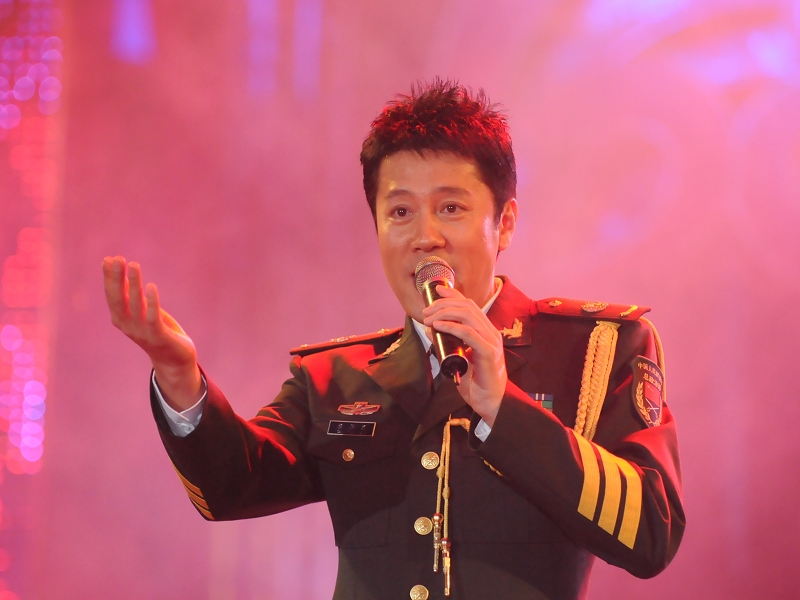
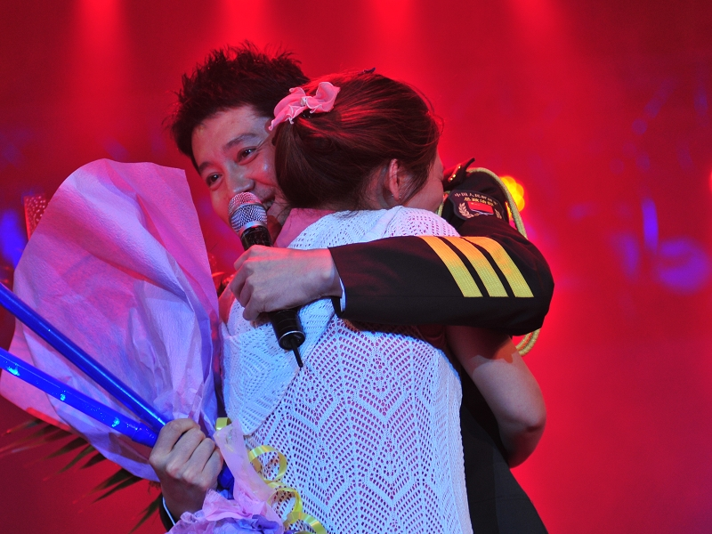
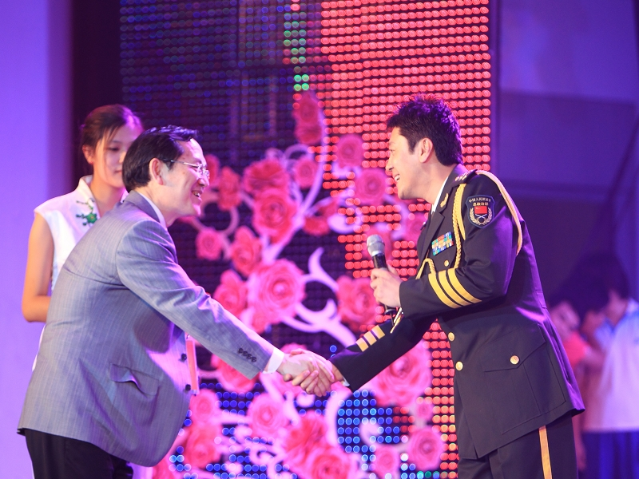
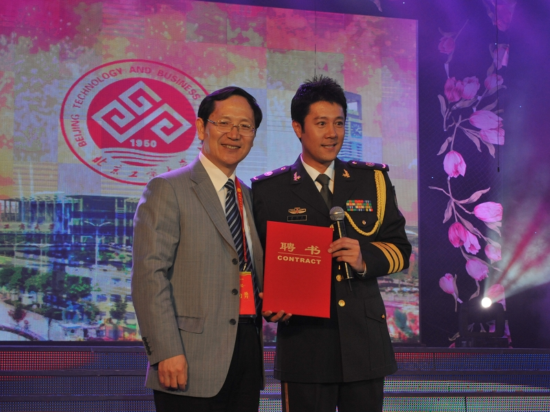

### [【校庆之夜】蔡国庆变“蔡老师”：我后悔没能来北京工商大学读书！](https://www.btbu.edu.cn/pub/bjgsdx/news/zhxw/33163.htm)

　　在今晚的校庆晚会上，应邀演出的著名通俗歌曲演唱家蔡国庆被师生们的激情打动，在演唱了《爱的世界》和《不能没有你》之后，又即兴清唱一曲，以感谢观众的热情。

　　蔡国庆说：“日益强盛的中国离不开像北京工商大学这样的大学，我后悔没能来北京工商大学读书！工商向社会输送人才，而大学是共和国的精英，希望一曲《不能没有你》，能够表达我对工商校庆最神圣的祝愿。”

　　演出结束，校长谭向勇亲自上台向蔡国庆颁发了聘书，聘请蔡国庆为我校艺术团指导教师。在听蔡国庆表示后悔没当成工商大学的学生，校长笑言，不能让蔡国庆当学生，否则其他的学生都不上课而去追星了，“所以，只能请你做工商大学的老师了。”

 

 

### [2010年6月11日，北京工商大学庆祝建校六十周年晚会](https://dag.btbu.edu.cn/wszt/jrgs/xqsk/55274.htm)

**图片来自北京工商大学档案馆（校史馆）**

 

 

### [2010年6月11日，学校特聘著名歌唱家蔡国庆担任学生艺术团指导老师](https://dag.btbu.edu.cn/wszt/jrgs/xqsk/55287.htm)

**图片来自北京工商大学档案馆（校史馆）**

 

 

